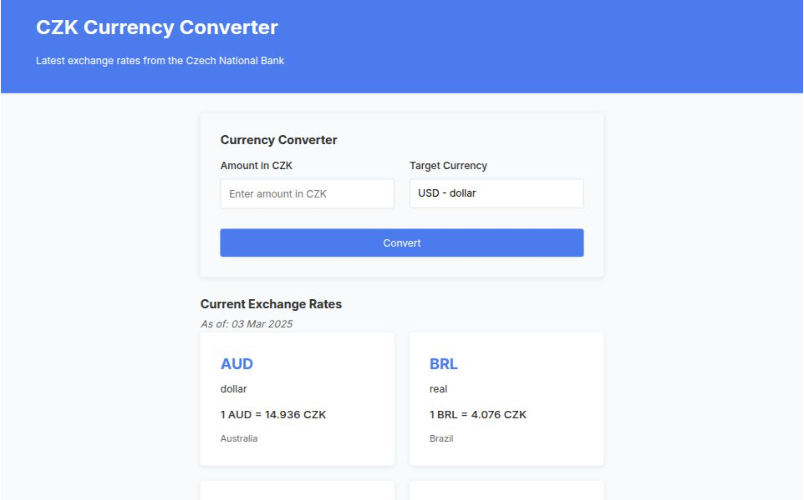

[](https://github.com/developer239/conversion-rate-app/actions/workflows/ci-cd.yml)

# Currency Converter

A currency conversion app built with Astro and React that displays the latest exchange rates from the Czech National Bank and allows users to convert CZK to other currencies.

**~74 gzip** (+ ~48KB font)

- 📚 [app](https://conversion-rate-app.vercel.app/)

**Only Few Dependencies:**
- Astro
- React
- Linaria (like styled-components but static)
- Vitest (like jest but closer to vite ecosystem)



## Architecture

This application uses Astro's islands architecture to deliver a fast, mostly static site with targeted interactivity. The key components:

1. **Static Components (Astro):**
    - Header and navigation
    - Currency rate list
    - Site layout and structure

2. **Interactive Components (React):**
    - Currency converter form

3. **Data Strategy:**
    - Fetch CNB data at build time
    - Daily rebuild with [GitHub Actions](.github/workflows/ci-cd.yml)

## Development

### Setup

1. Clone the repository:
   ```
   git clone https://github.com/yourusername/conversion-rate-app.git
   cd conversion-rate-app
   ```

2. Install dependencies:
   ```
   yarn install
   ```

3. Start the development server:
   ```
   npm run dev
   ```

4. Open your browser at `http://localhost:4321`

Additional commands:

- `npm run build` - Build the application
- `npm run test` - Run tests
- `npm run preview` - Build and run production preview
- `npm run lint` - Run ESLint
- `npm run typecheck` - Run TypeScript type checking

### Build

```
npm run build
```

### Testing

```
npm run test
```

## Deployment

The application is automatically deployed to Vercel through GitHub Actions:

1. Merge changes to the main branch
2. GitHub Actions will run tests and build
3. If successful, you can manually deploy to Vercel using GitHub Actions
